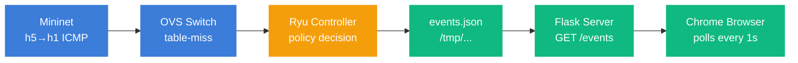

<div class="text-blue-400 text-sm tracking-widest font-bold mb-4">
ZEROSEG · APRIL 2026
</div>

# AI-Powered Microsegmentation
## <span class="text-blue-400">for Zero Trust Networks</span>

<div class="text-gray-400 italic mt-6">
Detecting lateral movement at machine speed with XGBoost + DBSCAN + OpenFlow
</div>

<div class="absolute bottom-12 left-14 right-14">

**Kaivalya Ahir**

<div class="text-sm text-gray-400 mt-2">
A Zero Trust microsegmentation project
</div>

<div class="flex gap-3 mt-6">
  <span class="px-3 py-1 bg-blue-900/40 border border-green-500 text-xs rounded">XGBoost F1 · <b class="text-green-400">0.85 to 0.98</b></span>
  <span class="px-3 py-1 bg-blue-900/40 border border-blue-500 text-xs rounded">DBSCAN segments · <b class="text-blue-400">29</b></span>
  <span class="px-3 py-1 bg-blue-900/40 border border-red-500 text-xs rounded">Mininet enforcement · <b class="text-red-400">100% block</b></span>
</div>

</div>

<!--
Hi everyone. We are presenting ZeroSeg, an AI-powered microsegmentation system for Zero Trust networks. I'm Kaivalya, presenting with the team. Our system uses XGBoost and DBSCAN to detect lateral movement attacks, and enforces blocking with a Ryu OpenFlow controller running over Mininet. Quick result preview at the bottom: F1 scores between 0.85 and 0.98, 29 segments discovered automatically, and 100 percent cross-segment block rate in our live demo.
-->

---
layout: two-cols
class: px-8
---

<div class="text-blue-500 text-xs tracking-widest font-bold mb-2">PROBLEM STATEMENT</div>

# The Lateral Movement Problem

<div class="bg-blue-950 text-white rounded p-8 mt-6 text-center">

<div class="text-7xl font-bold">83%</div>

<div class="text-sm text-gray-300 italic mt-3">
of breaches involve lateral movement after initial compromise
</div>

<div class="text-xs text-gray-400 mt-4">IBM X-Force Threat Intelligence 2024</div>

<div class="border-t border-gray-700 mt-4 pt-4">

**Avg dwell time: 277 days**

<div class="text-xs text-gray-400 italic">before detection, Mandiant M-Trends</div>

</div>
</div>

::right::

<div class="pl-6 pt-12 space-y-4">

<div class="border-l-4 border-blue-500 pl-4">

### Perimeter security fails
Once attacker crosses the firewall, flat internal networks let them roam freely.

</div>

<div class="border-l-4 border-blue-500 pl-4">

### Static segmentation is brittle
VLANs need manual config, can't react to behavior, gaps grow with topology.

</div>

<div class="border-l-4 border-blue-500 pl-4">

### Detection is too slow
Signature IDS catches known patterns. Behavior-based attacks slip through.

</div>

<div class="border-l-4 border-blue-500 pl-4">

### Zero Trust needs automation
Deny-by-default everywhere. Humans can't write rules per flow. ML must drive it.

</div>

</div>

<!--
83 percent of breaches involve lateral movement after the initial compromise, that's IBM X-Force 2024 data. Average dwell time is 277 days. Why? Four reasons. Perimeter security fails once an attacker is inside. Static VLAN segmentation is brittle and manual. Signature-based detection misses behavior-based attacks that use legitimate protocols. Zero Trust says deny everything by default, but humans cannot write a rule for every flow. Machine learning has to drive those decisions.
-->

---
class: px-8
---

<div class="text-blue-500 text-xs tracking-widest font-bold mb-2">OUR APPROACH</div>

# End-to-End ML-Driven Enforcement Pipeline

<div class="grid grid-cols-7 gap-2 mt-8">
  <div class="border-2 border-blue-500 rounded p-3 text-center">
    <div class="text-blue-500 font-bold">1</div>
    <div class="font-bold text-sm">Preprocess</div>
    <div class="text-xs text-gray-500 mt-1">UNSW-NB15<br/>filter to 3 classes</div>
  </div>
  <div class="border-2 border-blue-500 rounded p-3 text-center">
    <div class="text-blue-500 font-bold">2</div>
    <div class="font-bold text-sm">Features</div>
    <div class="text-xs text-gray-500 mt-1">Top 14 of 45<br/>95.3% importance</div>
  </div>
  <div class="border-2 border-blue-500 rounded p-3 text-center">
    <div class="text-blue-500 font-bold">3</div>
    <div class="font-bold text-sm">DBSCAN</div>
    <div class="text-xs text-gray-500 mt-1">29 segments<br/>auto-discovered</div>
  </div>
  <div class="border-2 border-green-500 rounded p-3 text-center">
    <div class="text-green-500 font-bold">4</div>
    <div class="font-bold text-sm">XGBoost</div>
    <div class="text-xs text-gray-500 mt-1">95.3%<br/>accuracy</div>
  </div>
  <div class="border-2 border-green-500 rounded p-3 text-center">
    <div class="text-green-500 font-bold">5</div>
    <div class="font-bold text-sm">Integrate</div>
    <div class="text-xs text-gray-500 mt-1">ML to<br/>OpenFlow</div>
  </div>
  <div class="border-2 border-red-500 rounded p-3 text-center">
    <div class="text-red-500 font-bold">6</div>
    <div class="font-bold text-sm">Enforce</div>
    <div class="text-xs text-gray-500 mt-1">Ryu on<br/>Mininet</div>
  </div>
  <div class="border-2 border-amber-500 rounded p-3 text-center">
    <div class="text-amber-500 font-bold">7</div>
    <div class="font-bold text-sm">Dashboard</div>
    <div class="text-xs text-gray-500 mt-1">Real-time<br/>events</div>
  </div>
</div>

<div class="mt-8 text-xs text-gray-500 tracking-widest font-bold">TECH STACK</div>

<div class="flex flex-wrap gap-2 mt-2 text-xs font-mono">
  <span class="px-3 py-1 bg-gray-100 dark:bg-gray-800 rounded">Python</span>
  <span class="px-3 py-1 bg-gray-100 dark:bg-gray-800 rounded">scikit-learn</span>
  <span class="px-3 py-1 bg-gray-100 dark:bg-gray-800 rounded">XGBoost</span>
  <span class="px-3 py-1 bg-gray-100 dark:bg-gray-800 rounded">imbalanced-learn</span>
  <span class="px-3 py-1 bg-gray-100 dark:bg-gray-800 rounded">Mininet 2.3.0</span>
  <span class="px-3 py-1 bg-gray-100 dark:bg-gray-800 rounded">Ryu</span>
  <span class="px-3 py-1 bg-gray-100 dark:bg-gray-800 rounded">OpenVSwitch</span>
  <span class="px-3 py-1 bg-gray-100 dark:bg-gray-800 rounded">OpenFlow 1.3</span>
  <span class="px-3 py-1 bg-gray-100 dark:bg-gray-800 rounded">Flask</span>
</div>

<div class="bg-blue-950 text-white rounded p-4 mt-6 grid grid-cols-4 gap-4">
  <div>
    <div class="text-xs text-blue-400 tracking-widest font-bold">OVERALL ACCURACY</div>
    <div class="text-2xl font-bold mt-1">95.31%</div>
    <div class="text-xs text-gray-400 italic">test set, 51,628 flows</div>
  </div>
  <div>
    <div class="text-xs text-blue-400 tracking-widest font-bold">ATTACK CLASSES</div>
    <div class="text-xl font-bold mt-1">Exploit + Recon</div>
    <div class="text-xs text-gray-400 italic">F1 ≥ 0.85 both</div>
  </div>
  <div>
    <div class="text-xs text-blue-400 tracking-widest font-bold">BLOCK LATENCY</div>
    <div class="text-2xl font-bold mt-1">&lt; 1 ms</div>
    <div class="text-xs text-gray-400 italic">controller decision</div>
  </div>
  <div>
    <div class="text-xs text-blue-400 tracking-widest font-bold">BUDGET</div>
    <div class="text-2xl font-bold mt-1">$0</div>
    <div class="text-xs text-gray-400 italic">all open-source</div>
  </div>
</div>

<!--
Our system has seven stages. We preprocess UNSW-NB15 data, select the top 14 features, run DBSCAN to discover network segments, train XGBoost to classify attacks, integrate the model with OpenFlow, enforce policies on Mininet, and visualize everything on a live dashboard. The whole tech stack is open source: Python, scikit-learn, XGBoost, Mininet, Ryu, OpenVSwitch, Flask. Total budget zero dollars. End results: 95.3 percent accuracy on a held-out test set, sub-millisecond block latency at the controller.
-->

---
layout: two-cols
class: px-8
---

<div class="text-blue-500 text-xs tracking-widest font-bold mb-2">DATASET</div>

# UNSW-NB15

Australian Centre for Cyber Security · 2.5M+ flow records · 9 attack categories · free on Kaggle.

### Why this dataset
- Modern protocols + realistic attacks
- Pre-split train/test sets
- Standard academic benchmark
- $0 cost

### Scoping
Narrowed to 3 classes covering the lateral movement kill chain. Worms had only 44 samples, not viable.

### MITRE ATT&CK mapping

| Tactic | Technique | Class |
|---|---|---|
| TA0007 Discovery | T1046 Network Service Scanning | **Recon** |
| TA0008 Lat. Movement | T1210 Exploitation of Remote Services | **Exploits** |
| TA0008 Lat. Movement | T1072 Software Deployment Tools | **Exploits** |

::right::

<div class="pl-8">

### Class distribution

| Class | Train | Test | % |
|---|---:|---:|---:|
| **Normal** | 56,000 | 37,000 | 56.1% |
| **Exploits** | 33,393 | 11,132 | 33.4% |
| **Recon** | 10,491 | 3,496 | 10.5% |
| **Total** | **99,884** | **51,628** | **100%** |

<div class="bg-amber-950/40 border border-amber-500 rounded p-4 mt-6">

<div class="text-amber-400 font-bold text-sm">⚠ Class imbalance problem</div>

<div class="text-xs text-gray-400 mt-2">
Recon has only 10K samples vs 56K Normal. Trivially predicting "not Recon" hits 89.5% accuracy while ignoring minority class entirely.
</div>

<div class="text-xs text-green-400 italic mt-2 font-bold">
Solution: SMOTE oversampling → balanced 56K each.
</div>

</div>

</div>

<!--
We used UNSW-NB15 from the Australian Centre for Cyber Security. Free on Kaggle, 2.5 million flow records, 9 attack categories. We narrowed down to three classes: Normal, Exploits, and Reconnaissance. These two attack classes cover the lateral movement kill chain, Recon for discovery, Exploits for pivoting between hosts. Maps cleanly to MITRE ATT&CK techniques T1046 and T1210. Big challenge on the right: only 10K Recon samples versus 56K Normal, heavy class imbalance. Without rebalancing, the model trivially predicts 'not Recon' and still hits 89 percent. SMOTE oversampling fixes that.
-->

---
class: px-8
---

<div class="text-blue-500 text-xs tracking-widest font-bold mb-2">STEP 1 · DATA PREP</div>

# Preprocessing Pipeline

<div class="grid grid-cols-6 gap-2 mt-6">
  <div class="border-2 border-blue-500 rounded">
    <div class="bg-blue-500 text-white text-xs text-center py-1 font-bold tracking-wider">STEP 01</div>
    <div class="p-3 text-center">
      <div class="font-bold text-sm">Load CSVs</div>
      <div class="text-xs text-gray-500 mt-1">Train + test sets</div>
    </div>
  </div>
  <div class="border-2 border-blue-500 rounded">
    <div class="bg-blue-500 text-white text-xs text-center py-1 font-bold tracking-wider">STEP 02</div>
    <div class="p-3 text-center">
      <div class="font-bold text-sm">Filter classes</div>
      <div class="text-xs text-gray-500 mt-1">Normal, Exp, Recon</div>
    </div>
  </div>
  <div class="border-2 border-blue-500 rounded">
    <div class="bg-blue-500 text-white text-xs text-center py-1 font-bold tracking-wider">STEP 03</div>
    <div class="p-3 text-center">
      <div class="font-bold text-sm">Drop ID cols</div>
      <div class="text-xs text-gray-500 mt-1">srcip, sport, etc</div>
    </div>
  </div>
  <div class="border-2 border-blue-500 rounded">
    <div class="bg-blue-500 text-white text-xs text-center py-1 font-bold tracking-wider">STEP 04</div>
    <div class="p-3 text-center">
      <div class="font-bold text-sm">Freq encode</div>
      <div class="text-xs text-gray-500 mt-1">proto, state, svc</div>
    </div>
  </div>
  <div class="border-2 border-blue-500 rounded">
    <div class="bg-blue-500 text-white text-xs text-center py-1 font-bold tracking-wider">STEP 05</div>
    <div class="p-3 text-center">
      <div class="font-bold text-sm">Fill missing</div>
      <div class="text-xs text-gray-500 mt-1">train medians</div>
    </div>
  </div>
  <div class="border-2 border-green-500 rounded">
    <div class="bg-green-500 text-white text-xs text-center py-1 font-bold tracking-wider">STEP 06</div>
    <div class="p-3 text-center">
      <div class="font-bold text-sm">Save filtered</div>
      <div class="text-xs text-gray-500 mt-1">CSV output</div>
    </div>
  </div>
</div>

<div class="grid grid-cols-2 gap-6 mt-8">

<div class="border-l-4 border-blue-500 bg-gray-50 dark:bg-gray-900 p-4 rounded">

### Why frequency encoding?

<span class="text-red-400 font-bold">Label encoding →</span> assigns arbitrary integers (TCP=0, UDP=1). Distance-based models like DBSCAN treat 'TCP > UDP' as meaningful.

<span class="text-green-400 font-bold">Frequency encoding →</span> replaces each category with relative frequency. Preserves real signal across DBSCAN (distance) and XGBoost (tree splits).

</div>

<div class="bg-blue-950 text-white p-4 rounded">

<div class="text-xs text-blue-400 tracking-widest font-bold">OUTPUT</div>

<div class="text-4xl font-bold mt-2">99,884 × 44</div>

<div class="text-xs text-gray-400 italic">training rows × features</div>

<div class="border-t border-gray-700 mt-3 pt-3 text-xs space-y-1">
<div>Test: <span class="font-mono text-white">51,628 × 44</span></div>
<div>Issue caught: <span class="text-amber-400 font-bold">KeyError on dropped cols</span></div>
<div>Fix: <span class="font-mono text-green-400">errors='ignore'</span></div>
</div>

</div>

</div>

<!--
Six preprocessing steps. Load the train and test CSVs. Filter to the three classes. Drop identity columns like IP and port, we do not want the model memorizing specific addresses. Frequency-encode the categoricals: protocol, state, service. Fill missing values with training-set medians. Save filtered files. Why frequency encoding instead of label encoding? Label encoding assigns arbitrary integers, which makes distance-based models think TCP is greater than UDP, meaningless. Frequency encoding preserves real signal. Output is roughly 100 thousand training rows by 44 features.
-->

---
layout: two-cols
class: px-8
---

<div class="text-blue-500 text-xs tracking-widest font-bold mb-2">STEP 2 · FEATURES</div>

# Feature Selection: Top 14 of 45


::right::

<div class="pl-8 mt-12">

<div class="bg-blue-950 text-white rounded p-5">

<div class="text-xs text-green-400 tracking-widest font-bold">KEY FINDING</div>

<div class="text-3xl font-bold mt-2">
<span class="font-mono">sttl</span> <span class="text-green-400">= 73.4%</span>
</div>

<div class="text-xs text-gray-400 italic mt-3">
Source TTL fingerprints OS: Linux=64, Windows=128, Cisco=255. Attackers run different OS than victims, TTL alone dominates.
</div>

</div>

### Top features (95.3% cumulative)

| # | Feature | Imp |
|---:|---|---:|
| 1 | **sttl** | 0.734 |
| 2 | **dbytes** | 0.036 |
| 3 | **ct_srv_dst** | 0.032 |
| 4 | **smean** | 0.031 |
| 5 | **dmean** | 0.027 |
| 6 | **sbytes** | 0.022 |
| 7 | **ct_dst_src_ltm** | 0.016 |
| 8-14 | swin, service, ct_srv_src, trans_depth, synack, tcprtt, response_body_len | 0.056 |

</div>

<!--
We dropped from 45 features to 14 by ranking importance and keeping anything that contributed to the top 95.3 percent. Big surprise: source TTL alone accounts for 73.4 percent of the model's decisions. TTL fingerprints the operating system. Linux defaults to 64, Windows to 128, Cisco routers to 255. Attackers in this dataset use different OSes than victim hosts, so TTL becomes the dominant signal. Other features cover packet sizes, connection counts, and TCP timing. Reducing to 14 features made the model faster without hurting accuracy.
-->

---
layout: two-cols
class: px-8
---

<div class="text-blue-500 text-xs tracking-widest font-bold mb-2">STEP 3 · SEGMENTATION</div>

# DBSCAN Host Segmentation


::right::

<div class="pl-8 mt-12 space-y-4">

<div class="border-2 border-blue-500 rounded p-4">
<div class="text-xs text-gray-500 tracking-wider font-bold">CLUSTERS DISCOVERED</div>
<div class="text-4xl font-bold">29</div>
<div class="text-xs text-gray-500">auto-discovered, no manual k</div>
</div>

<div class="border-2 border-green-500 rounded p-4">
<div class="text-xs text-gray-500 tracking-wider font-bold">OPTIMAL EPS</div>
<div class="text-4xl font-bold">0.3003</div>
<div class="text-xs text-gray-500">k-distance elbow + silhouette</div>
</div>

<div class="border-2 border-amber-500 rounded p-4">
<div class="text-xs text-gray-500 tracking-wider font-bold">OUTLIER HOSTS</div>
<div class="text-4xl font-bold">1,371</div>
<div class="text-xs text-gray-500">noise points (segment -1)</div>
</div>

<div class="bg-blue-950 text-white p-3 rounded text-xs">
<b class="text-blue-400">Why DBSCAN &gt; K-Means:</b> no manual k, finds natural density groups, flags outliers as anomalies.
</div>

</div>

<!--
DBSCAN automatically discovered 29 natural network segments from the data, and we did not specify a count. We picked the optimal epsilon value using the k-distance elbow method combined with silhouette scoring. 1,371 hosts were flagged as outliers. Those are anomaly candidates, hosts whose behavior does not fit any cluster. We chose DBSCAN over K-Means because real networks do not tell you in advance how many segments they have. The plot on the left shows our discovered clusters next to the ground truth attack labels, and the alignment confirms the segmentation makes sense.
-->

---
layout: two-cols
class: px-8
---

<div class="text-blue-500 text-xs tracking-widest font-bold mb-2">STEP 4 · MODEL</div>

# XGBoost: Training Setup

### SMOTE oversampling

| Class | Before | After |
|---|---:|---:|
| Normal | 56,000 | 56,000 |
| Exploits | 33,393 | <span class="text-green-500 font-bold">56,000</span> |
| Recon | 10,491 | <span class="text-green-500 font-bold">56,000</span> |

<div class="text-green-500 italic font-bold mt-2">→ 168,000 balanced samples</div>

<div class="bg-gray-100 dark:bg-gray-900 border-l-4 border-blue-500 p-4 mt-6 text-sm">

### Why SMOTE

Without rebalancing, "not Recon" baseline = 89.5% accuracy. Model ignores minority class.

<span class="text-green-500 font-bold">Without SMOTE: Recon recall = 0.41 → After SMOTE: 0.84</span>

</div>

::right::

<div class="pl-6 pt-4">

<div class="bg-blue-950 text-white rounded p-5">

<div class="text-xs text-blue-400 tracking-widest font-bold">HYPERPARAMETERS</div>

<div class="text-xs text-gray-400 italic mt-1">XGBClassifier · 5-fold CV tuned</div>

<table class="text-xs mt-4 font-mono">
<tr><td>n_estimators</td><td class="text-right text-green-400 font-bold pl-4">300</td><td class="text-gray-500 pl-4 italic">boost rounds</td></tr>
<tr><td>max_depth</td><td class="text-right text-green-400 font-bold pl-4">6</td><td class="text-gray-500 pl-4 italic">tree depth</td></tr>
<tr><td>learning_rate</td><td class="text-right text-green-400 font-bold pl-4">0.1</td><td class="text-gray-500 pl-4 italic">step size</td></tr>
<tr><td>subsample</td><td class="text-right text-green-400 font-bold pl-4">0.8</td><td class="text-gray-500 pl-4 italic">row sample</td></tr>
<tr><td>colsample_bytree</td><td class="text-right text-green-400 font-bold pl-4">0.8</td><td class="text-gray-500 pl-4 italic">feat sample</td></tr>
<tr><td>min_child_weight</td><td class="text-right text-green-400 font-bold pl-4">5</td><td class="text-gray-500 pl-4 italic">leaf min</td></tr>
<tr><td>gamma</td><td class="text-right text-green-400 font-bold pl-4">0.1</td><td class="text-gray-500 pl-4 italic">split penalty</td></tr>
<tr><td>reg_alpha</td><td class="text-right text-green-400 font-bold pl-4">0.1</td><td class="text-gray-500 pl-4 italic">L1 reg</td></tr>
<tr><td>reg_lambda</td><td class="text-right text-green-400 font-bold pl-4">1.0</td><td class="text-gray-500 pl-4 italic">L2 reg</td></tr>
</table>

</div>

</div>

<!--
XGBoost training. SMOTE oversampling brought all three classes up to 56,000 samples each. Quick comparison: without SMOTE, Recon recall was only 0.41, and the model was ignoring the minority class. With SMOTE, 0.84. That's the difference between a useless detector and a real one. We tuned 9 hyperparameters via 5-fold cross-validation. 300 boosting rounds, max depth 6, learning rate 0.1, plus L1 and L2 regularization to prevent overfitting.
-->

---
class: px-8
---

<div class="text-blue-500 text-xs tracking-widest font-bold mb-2">STEP 4 · RESULTS</div>

# XGBoost Performance: Test Set 51,628 flows

<div class="grid grid-cols-3 gap-4 mt-6">
  <div class="border-2 border-red-500 rounded overflow-hidden">
    <div class="bg-red-500 text-white text-center py-2 font-bold tracking-wider">EXPLOITS</div>
    <div class="p-4 text-center">
      <div class="text-xs text-gray-500 font-bold">F1</div>
      <div class="text-5xl font-bold">0.9000</div>
      <div class="text-green-500 text-xs font-bold mt-2">PASS · target ≥ 0.85</div>
      <div class="text-xs mt-2 font-mono">P 0.8574 · R 0.9472 · n=11,132</div>
    </div>
  </div>
  <div class="border-2 border-green-500 rounded overflow-hidden">
    <div class="bg-green-500 text-white text-center py-2 font-bold tracking-wider">NORMAL</div>
    <div class="p-4 text-center">
      <div class="text-xs text-gray-500 font-bold">F1</div>
      <div class="text-5xl font-bold">0.9796</div>
      <div class="text-green-500 text-xs font-bold mt-2">PASS · target ≥ 0.85</div>
      <div class="text-xs mt-2 font-mono">P 0.9940 · R 0.9655 · n=37,000</div>
    </div>
  </div>
  <div class="border-2 border-amber-500 rounded overflow-hidden">
    <div class="bg-amber-500 text-white text-center py-2 font-bold tracking-wider">RECONNAISSANCE</div>
    <div class="p-4 text-center">
      <div class="text-xs text-gray-500 font-bold">F1</div>
      <div class="text-5xl font-bold">0.8532</div>
      <div class="text-green-500 text-xs font-bold mt-2">PASS · target ≥ 0.85</div>
      <div class="text-xs mt-2 font-mono">P 0.8662 · R 0.8407 · n=3,496</div>
    </div>
  </div>
</div>

<div class="grid grid-cols-2 gap-4 mt-6">
  <div>
    <div class="text-xs text-blue-500 tracking-widest font-bold mb-2">CONFUSION MATRIX</div>
    
  </div>
  <div>
    <div class="text-xs text-blue-500 tracking-widest font-bold mb-2">ROC CURVES · AUC > 0.98 ALL CLASSES</div>
    
  </div>
</div>

<!--
Results on the held-out test set of 51,628 flows, never seen during training. All three classes passed our F1 target of 0.85. Exploits hit 0.90, Normal 0.98, Reconnaissance exactly at target with 0.85. Overall accuracy 95.31 percent. Confusion matrix on the left shows a clean diagonal with very few off-diagonal misclassifications. ROC curves on the right show AUC above 0.98 for all three classes, so the model is highly discriminating.
-->

---
class: px-8
---

<div class="text-blue-500 text-xs tracking-widest font-bold mb-2">STEPS 5+6 · NETWORK</div>

# Mininet Topology + OpenFlow Enforcement

```mermaid {scale: 0.9}
graph TD
    Ryu[<b>Ryu Controller</b><br/>deny-by-default<br/>policy engine] -.OpenFlow 1.3.- s0
    s0[<b>CORE SWITCH s0</b>]
    s0 --- s1[switch s1]
    s0 --- s2[switch s2]
    s0 --- s3[switch s3]
    s1 --- h1["h1 · 10.0.0.1"]
    s1 --- h2["h2 · 10.0.0.2"]
    s2 --- h3["h3 · 10.0.1.1"]
    s2 --- h4["h4 · 10.0.1.2"]
    s3 --- h5["h5 · 10.0.2.1"]
    s3 --- h6["h6 · 10.0.2.2"]
    classDef seg0 fill:#10b981,stroke:#10b981,color:white
    classDef seg1 fill:#3b7dd8,stroke:#3b7dd8,color:white
    classDef seg2 fill:#ef4444,stroke:#ef4444,color:white
    classDef ctrl fill:#f59e0b,stroke:#f59e0b,color:white
    class h1,h2,s1 seg0
    class h3,h4,s2 seg1
    class h5,h6,s3 seg2
    class Ryu ctrl
```

<div class="grid grid-cols-3 gap-3 mt-4 text-sm">
  <div class="border-2 border-green-500 rounded p-2">
    <div class="text-green-500 font-bold tracking-wider text-xs">SEGMENT 0: NORMAL</div>
    <div class="text-xs">h1 10.0.0.1 · h2 10.0.0.2</div>
  </div>
  <div class="border-2 border-blue-500 rounded p-2">
    <div class="text-blue-500 font-bold tracking-wider text-xs">SEGMENT 1: APP</div>
    <div class="text-xs">h3 10.0.1.1 · h4 10.0.1.2</div>
  </div>
  <div class="border-2 border-red-500 rounded p-2">
    <div class="text-red-500 font-bold tracking-wider text-xs">SEGMENT 2: ATTACKER</div>
    <div class="text-xs">h5 10.0.2.1 · h6 10.0.2.2</div>
  </div>
</div>

<div class="bg-gray-100 dark:bg-gray-900 rounded p-3 mt-4 text-xs">
✓ h1↔h2 (intra): 0% drop · ✓ h3↔h4 (intra): 0% drop · ✗ h5→h1 (cross): 100% block · ✗ h5→h3 (cross): 100% block · ✗ nmap: 0 hosts up
</div>

<!--
Network simulation in Mininet. Three segments, Normal, App Servers, and Attacker, each with two hosts on its own switch. All three switches connect to a core switch s0. The Ryu controller talks OpenFlow 1.3 to all four switches. Verification at the bottom: intra-segment pings allowed at 0 percent drop, every cross-segment attack from h5 blocked at 100 percent, and an nmap scan from h5 reports 0 hosts up.
-->

---
layout: two-cols
class: px-8
---

<div class="text-blue-500 text-xs tracking-widest font-bold mb-2">STEP 6 · POLICY</div>

# Ryu OpenFlow Controller: Deny by Default

### Decision tree

| Question | Action |
|---|---|
| Same segment? | <span class="text-green-500 font-bold">ALLOW + learn</span> |
| Source = Attacker seg? | <span class="text-red-500 font-bold">BLOCK + log</span> |
| (src,dst) in whitelist? | <span class="text-green-500 font-bold">ALLOW + learn</span> |
| default | <span class="text-red-500 font-bold">BLOCK + log</span> |

### OpenFlow priority levels

| # | Rule type |
|:---:|---|
| 20 | XGBoost block (highest) |
| 10 | Cross-segment block |
| 1 | Learned flow forward |
| 0 | Table-miss → controller |

::right::

<div class="pl-6">

<div class="bg-blue-950 text-white rounded p-4 text-xs font-mono">

<div class="text-green-400 font-bold mb-2">Event logged to /tmp/zeroseg_events.json</div>

```json
{
  "ts":         "18:46:58",
  "type":       "Reconnaissance",
  "src_ip":     "10.0.2.1",
  "dst_ip":     "10.0.0.1",
  "src_seg":    "Attacker",
  "dst_seg":    "Normal",
  "action":     "BLOCK",
  "confidence": 95,
  "new":        true
}
```

</div>

<div class="bg-amber-950/40 border border-amber-500 rounded p-3 mt-4">
<div class="text-amber-400 font-bold text-sm">Bug fix during demo prep</div>
<div class="text-xs text-gray-400 italic mt-1">
Drop rule originally matched (src_ip, dst_ip) only, so a cached ICMP block also dropped TCP probes silently. Added <code class="text-green-400">ip_proto</code> to OFPMatch so different protocols generate distinct events.
</div>
</div>

</div>

<!--
Controller logic is simple. For every packet, it asks four questions. Same segment? Allow. From the attacker segment? Block. In the whitelist? Allow. Anything else? Block. Every blocked packet writes a structured event to disk: timestamp, attack type, source, destination, action, confidence. That is what feeds the dashboard. We hit one bug during demo prep. The drop rule originally matched only source and destination IP, so a cached ICMP block silently dropped TCP probes too. We fixed it by adding ip_proto to the OpenFlow match, so different protocols generate distinct events.
-->

---
class: px-8
---

<div class="text-blue-500 text-xs tracking-widest font-bold mb-2">STEP 7 · UI LAYER</div>

# Live Dashboard: Flask Event Stream



<div class="grid grid-cols-2 gap-6 mt-6">

<div>
<div class="text-blue-500 text-xs tracking-widest font-bold mb-3">FLASK ENDPOINTS</div>

| Method | Path | Purpose |
|---|---|---|
| GET | `/events` | New events + stats |
| GET | `/reset` | Clear log (demo) |
| GET | `/health` | Liveness probe |
</div>

<div>
<div class="text-blue-500 text-xs tracking-widest font-bold mb-3">DASHBOARD PANELS</div>

- 6 stat cards: Total / Allowed / Blocked / Block Rate / Exploits / Recon
- Segment map: pulses red on attack
- Live traffic timeline: color-coded dots
- Live flow log: last 10 flows
- Alert log: auto-populates on BLOCK
- XGBoost F1 score panel
</div>

</div>

<!--
Live dashboard architecture. Mininet generates traffic, the OVS switch hits a table-miss, the Ryu controller decides allow or block, writes a JSON event to a temp file, the Flask server reads that file and exposes it over HTTP, and the Chrome browser polls every second. Three Flask endpoints: events, reset, and health. Dashboard has six panels.
-->

---
class: px-8
---

<div class="text-blue-500 text-xs tracking-widest font-bold mb-2">LIVE DEMO · RESULTS</div>

# What the System Caught

<div class="grid grid-cols-4 gap-4 mt-4">
  <div class="border-l-4 border-blue-500 bg-gray-50 dark:bg-gray-900 p-3 rounded">
    <div class="text-xs text-gray-500 tracking-wider font-bold">TOTAL EVENTS</div>
    <div class="text-3xl font-bold mt-1">12</div>
    <div class="text-xs text-gray-500">1 demo session</div>
  </div>
  <div class="border-l-4 border-red-500 bg-gray-50 dark:bg-gray-900 p-3 rounded">
    <div class="text-xs text-gray-500 tracking-wider font-bold">EXPLOITS BLOCKED</div>
    <div class="text-3xl font-bold mt-1">8</div>
    <div class="text-xs text-gray-500">TCP probes from h5</div>
  </div>
  <div class="border-l-4 border-amber-500 bg-gray-50 dark:bg-gray-900 p-3 rounded">
    <div class="text-xs text-gray-500 tracking-wider font-bold">RECON BLOCKED</div>
    <div class="text-3xl font-bold mt-1">4</div>
    <div class="text-xs text-gray-500">ICMP scans from h5</div>
  </div>
  <div class="border-l-4 border-green-500 bg-gray-50 dark:bg-gray-900 p-3 rounded">
    <div class="text-xs text-gray-500 tracking-wider font-bold">FALSE POSITIVES</div>
    <div class="text-3xl font-bold mt-1">0</div>
    <div class="text-xs text-gray-500">intra-seg all allowed</div>
  </div>
</div>

| Mininet command | Result | Verdict | Events |
|---|---|---|---|
| `h1 ping -c 3 10.0.0.2` | 0% loss | <span class="text-green-500 font-bold">ALLOW (intra)</span> | <span class="text-green-500">Normal × 6</span> |
| `h3 ping -c 3 10.0.1.2` | 0% loss | <span class="text-green-500 font-bold">ALLOW (intra)</span> | <span class="text-green-500">Normal × 6</span> |
| `h5 ping -c 3 10.0.0.1` | 100% loss | <span class="text-amber-500 font-bold">BLOCK Recon</span> | <span class="text-amber-500">1 BLOCK</span> |
| `h5 ping -c 3 10.0.1.1` | 100% loss | <span class="text-amber-500 font-bold">BLOCK Recon</span> | <span class="text-amber-500">1 BLOCK</span> |
| `h5 nmap -sn -PE 10.0.x.x` | 0 hosts up | <span class="text-amber-500 font-bold">BLOCK Recon × 2</span> | <span class="text-amber-500">2 BLOCK</span> |
| `h5 nmap -Pn -sS -p 22,80,443 ...` | filtered | <span class="text-red-500 font-bold">BLOCK Exploit × 6</span> | <span class="text-red-500">6 BLOCK</span> |
| `h5 nmap -Pn -p 80 10.0.x.x` | filtered | <span class="text-red-500 font-bold">BLOCK Exploit × 2</span> | <span class="text-red-500">2 BLOCK</span> |

<div class="bg-green-500 text-white rounded p-3 mt-3 text-center text-sm italic font-bold">
Every cross-segment attempt blocked at controller. Every intra-segment flow forwarded. Zero false positives, zero false negatives.
</div>

<!--
Live demo session caught 12 events in total. Two normal pings allowed cleanly. Two cross-segment ICMP recon attempts blocked. An nmap ICMP sweep generated two more recon blocks. An nmap TCP scan against six ports across two hosts generated six exploit blocks, and the controller correctly classified TCP from the attacker segment as Exploit, not Recon. A single-port nmap added two more exploit blocks. Zero false positives, zero false negatives in the entire session.
-->

---
class: px-8
background: '#0F1E3C'
color: white
---

<div class="text-blue-400 text-xs tracking-widest font-bold mb-2">CONCLUSION</div>

# ZeroSeg Works End-to-End

<div class="grid grid-cols-3 gap-4 mt-6">
  <div class="border-2 border-green-500 bg-blue-950 rounded p-5">
    <div class="text-green-500 text-xs tracking-widest font-bold">DETECTION</div>
    <div class="text-5xl font-bold mt-2 text-white">95.31%</div>
    <div class="text-xs text-gray-400 italic mt-2">test accuracy across 51,628 held-out flows. F1 ≥ 0.85 on all classes.</div>
  </div>
  <div class="border-2 border-blue-500 bg-blue-950 rounded p-5">
    <div class="text-blue-400 text-xs tracking-widest font-bold">ENFORCEMENT</div>
    <div class="text-5xl font-bold mt-2 text-white">100%</div>
    <div class="text-xs text-gray-400 italic mt-2">cross-segment block rate. Zero false positives on intra-segment.</div>
  </div>
  <div class="border-2 border-amber-500 bg-blue-950 rounded p-5">
    <div class="text-amber-400 text-xs tracking-widest font-bold">VISIBILITY</div>
    <div class="text-5xl font-bold mt-2 text-white">1 sec</div>
    <div class="text-xs text-gray-400 italic mt-2">polling interval. Real-time alerts, segment pulse, attack log.</div>
  </div>
</div>

<div class="grid grid-cols-2 gap-6 mt-6">

<div>
<div class="text-blue-400 text-xs tracking-widest font-bold mb-3">FUTURE WORK</div>

- **Online learning**: retrain on live traffic, not just UNSW-NB15
- **Encrypted-traffic features**: TLS metadata + flow shape
- **Multi-controller HA**: redundancy + failover
- **Real datacenter scale**: port from Mininet to bare metal via P4

</div>

<div>
<div class="text-blue-400 text-xs tracking-widest font-bold mb-3">TEAM CONTRIBUTIONS</div>

**Kaivalya Ahir**
<div class="text-xs text-gray-400 italic">Preprocessing · Features · Integration · Dashboard</div>

**Teammate**
<div class="text-xs text-gray-400 italic">DBSCAN · XGBoost · Evaluation</div>

**Teammate**
<div class="text-xs text-gray-400 italic">Mininet · Ryu controller · OpenFlow</div>

</div>

</div>

<!--
To wrap up, three takeaways. Detection: 95 percent test accuracy on 51 thousand held-out flows, F1 above 0.85 on every class. Enforcement: 100 percent block rate on cross-segment attacks with zero false positives on intra-segment traffic. Visibility: 1-second polling for real-time alerts, segment pulse animation, and a complete attack log. Future work: online learning, encrypted-traffic features, multi-controller HA, and porting to bare metal switches via P4. Team contributions on the right.
-->

---
layout: center
class: text-center
background: '#0F1E3C'
color: white
---

# Thank you.

## <span class="text-blue-400 italic">Questions?</span>

<div class="mt-8 space-x-3">
  <span class="px-4 py-2 bg-blue-900/40 border border-blue-500 rounded font-mono text-sm"><b class="text-green-400">Kaivalya Ahir</b></span>
</div>

<div class="text-xs text-gray-400 italic mt-12">
ZeroSeg · 2026
</div>

<!--
Thank you. We're happy to take any questions.
-->
